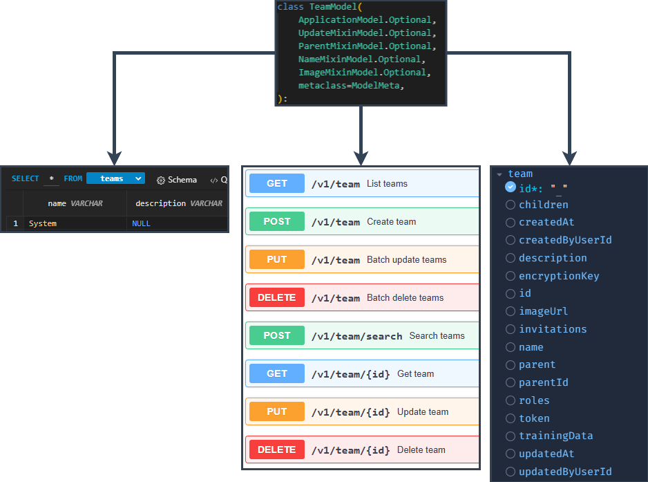

# JamesonRGrieve's Zephyrex Framework Server



## Documentation Viewing

### Recommended: Obsidian

This documentation is best viewed using [Obsidian](https://obsidian.md/) with the custom plugin included in this repository. The plugin automatically hides folders without documentation, providing a clean, focused view of all available documentation.

**Setup:**
1. Install [Obsidian](https://obsidian.md/)
2. Open this repository as an Obsidian vault
3. The custom plugin (`hide-folders-without-md`) will automatically activate
4. Navigate through the documentation using Obsidian's graph view and linked references

### Alternative: Traditional Navigation

Documentation can also be viewed directly in your text editor or GitHub, though you won't benefit from the cross-referencing and visualization features that Obsidian provides.

## Documentation Directory

### Framework Overview
- **[src/zephyrex/Framework.md](../src/zephyrex/Framework.md)** - Comprehensive framework architecture overview
- **[src/zephyrex/Framework.Test.md](../src/zephyrex/Framework.Test.md)** - Testing philosophy and patterns

### Core Library Components
- **[src/zephyrex/lib/LIB.Overview.md](../src/zephyrex/lib/LIB.Overview.md)** - Library components overview and integration
- **[src/zephyrex/lib/LIB.Dependencies.md](../src/zephyrex/lib/LIB.Dependencies.md)** - System, Python, and extension dependency management
- **[src/zephyrex/lib/LIB.Pydantic.md](../src/zephyrex/lib/LIB.Pydantic.md)** - Model utilities and registry management
- **[src/zephyrex/lib/LIB.Pydantic2FastAPI.md](../src/zephyrex/lib/LIB.Pydantic2FastAPI.md)** - Automatic FastAPI router generation
- **[src/zephyrex/lib/LIB.Logging.md](../src/zephyrex/lib/LIB.Logging.md)** - Centralized logging system

### Database Layer
- **[src/zephyrex/database/DB.Management.md](../src/zephyrex/database/DB.Management.md)** - Database management and configuration
- **[src/zephyrex/database/DB.Patterns.md](../src/zephyrex/database/DB.Patterns.md)** - Database design patterns and mixins
- **[src/zephyrex/database/DB.Permissions.md](../src/zephyrex/database/DB.Permissions.md)** - Permission system architecture
- **[src/zephyrex/database/DB.Seeding.md](../src/zephyrex/database/DB.Seeding.md)** - Data seeding and initialization
- **[src/zephyrex/database/DB.Test.md](../src/zephyrex/database/DB.Test.md)** - Database testing patterns

### Business Logic Layer
- **[src/zephyrex/logic/BLL.Patterns.md](../src/zephyrex/logic/BLL.Patterns.md)** - Business logic patterns and best practices
- **[src/zephyrex/logic/BLL.Abstraction.md](../src/zephyrex/logic/BLL.Abstraction.md)** - Abstract BLL manager functionality
- **[src/zephyrex/logic/BLL.Authentication.md](../src/zephyrex/logic/BLL.Authentication.md)** - Authentication system implementation
- **[src/zephyrex/logic/BLL.Hooks.md](../src/zephyrex/logic/BLL.Hooks.md)** - Hook system architecture and usage
- **[src/zephyrex/logic/BLL.Schema.md](../src/zephyrex/logic/BLL.Schema.md)** - Pydantic schema patterns
- **[src/zephyrex/logic/BLL.Test.md](../src/zephyrex/logic/BLL.Test.md)** - Business logic testing patterns
- **[src/zephyrex/logic/SVC.Patterns.md](../src/zephyrex/logic/SVC.Patterns.md)** - Background service patterns
- **[src/zephyrex/logic/SVC.Test.md](../src/zephyrex/logic/SVC.Test.md)** - Service testing patterns

### Endpoint Layer
- **[src/zephyrex/endpoints/EP.Patterns.md](../src/zephyrex/endpoints/EP.Patterns.md)** - API endpoint patterns and usage
- **[src/zephyrex/endpoints/EP.Abstraction.md](../src/zephyrex/endpoints/EP.Abstraction.md)** - Abstract endpoint router
- **[src/zephyrex/endpoints/EP.GQL.md](../src/zephyrex/endpoints/EP.GQL.md)** - GraphQL integration
- **[src/zephyrex/endpoints/EP.Schema.md](../src/zephyrex/endpoints/EP.Schema.md)** - API schema patterns
- **[src/zephyrex/endpoints/EP.Test.md](../src/zephyrex/endpoints/EP.Test.md)** - Endpoint testing patterns

### Extension System
- **[src/zephyrex/extensions/EXT.Patterns.md](../src/zephyrex/extensions/EXT.Patterns.md)** - Extension system architecture
- **[src/zephyrex/extensions/PRV.Patterns.md](../src/zephyrex/extensions/PRV.Patterns.md)** - Provider rotation system

### Migration System
- **[src/zephyrex/database/migrations/DB.Migrations.md](../src/zephyrex/database/migrations/DB.Migrations.md)** - Database migration patterns

## Quick Start

### Installation

From PyPI:
```sh
pip install zephyrex
```

From source (for framework development):
```sh
git clone https://git.zephyrex.dev/ZephyrexTechnologies/ServerFramework.git
cd ServerFramework
pip install -e ".[dev]"
```

Every bundled extension is included; each one's third-party packages install through an extra of the same name, hyphenated: `pip install "zephyrex[auth-mfa,secret-vault]"`. `cache` adds the Redis/Valkey client core uses for its cache and rate limiter, and `all` installs every extra. The extras are generated from what each extension and its providers declare (`python -m zephyrex.extensions.sync_dependencies`; the test suite fails if they drift).

### Requirements
- Python 3.11+

### Running the server
```sh
python -m zephyrex run   # or the console script: `zephyrex run`
```
The server boots on port 1996 by default.

### Basic Configuration
```
APP_NAME=MyApp
SERVER_URI=http://localhost:1996
APP_EXTENSIONS=email,auth_mfa,database,payment
```

## Documentation Philosophy

1. **Architectural Focus**: Documentation describes the "why" and "how" of components, not just the "what"
2. **Minimal Code Snippets**: Code examples are minimal; the documentation focuses on patterns and concepts
3. **Cross-Referenced**: Heavy use of links between related documentation
4. **Layer Separation**: Documentation organized by architectural layer
5. **Pattern-Based**: Emphasis on reusable patterns over specific implementations

## Contributing to Documentation

When adding new documentation:

1. Follow the existing naming convention: `LAYER.Component.md`
2. Focus on architectural decisions and patterns
3. Link to related documentation using relative paths
4. Keep code snippets minimal and focused
5. Include "Best Practices" sections where appropriate

## Framework Benefits

This framework provides:

- **Pydantic-First Design**: Single source of truth for all schemas
- **Zero Boilerplate**: Automatic generation of database models, endpoints, and documentation
- **True Testing**: No mocks, real implementations with proper isolation
- **Extension Architecture**: Modular plugin system with isolated migrations
- **Type Safety**: End-to-end type checking from API to database

For a comprehensive overview, start with [Framework.md](../src/zephyrex/Framework.md)

## License

[AGPL-3.0-or-later](../LICENSE). A server built on Zephyrex offers its users its source, as section 13 of the license requires for network use: `GET /source` returns the source URL, version and license. It points at `APP_REPOSITORY`, which defaults to the canonical repository, https://git.zephyrex.dev/ZephyrexTechnologies/ServerFramework; a deployment that runs modified code sets `APP_REPOSITORY` to its own source.

Every response also carries the source, always:

| Header | Values |
|---|---|
| `Source-Link` | `APP_REPOSITORY` |
| `Source-Hash-Status` | `verified`: the running source matches the release it was installed from; `modified`: it does not; `unverified`: there is no release to check against (a source checkout) |
| `Source-Git-Status` | The running source's git state: `clean` or `dirty` in a git checkout of it; `none` when it is not one (no `.git`, as for an installed release, which `Source-Hash-Status` vouches for); `error` when git cannot say (not installed, timed out, refused) |

Each release wheel carries `zephyrex/_provenance.json`, the digest of exactly what it ships and the commit it was built from, covered by the wheel's sigstore signature; the running server hashes its own source against it at startup, offline. `GET /source` adds the version, commit, digest and, per loaded extension, its own source: a bundled extension is part of the framework's, and one loaded from your extensions directory declares `repository` in its `manifest.toml` and is checked on its own. None of this changes what the server does: it reports, it never refuses to run.
