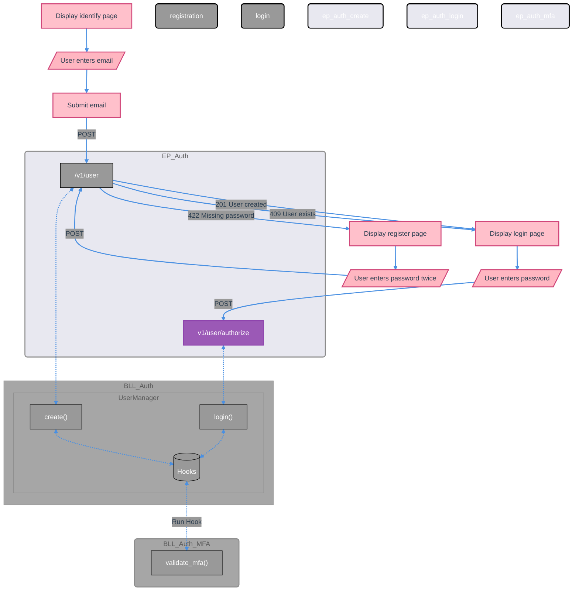

# Authentication & Authorization System

This document outlines the comprehensive authentication and authorization system implemented in the BLL layer.

## Core Components

### User Management
- **UserManager** - Core user CRUD operations with metadata support
- **UserCredentialManager** - Password management with history tracking
- **UserRecoveryQuestionManager** - Security questions for account recovery
- **UserMetadataManager** - User preferences and additional data
- **SessionManager** - Active session management
- **FailedLoginAttemptManager** - Login failure tracking and account security

### Team & Role Management
- **TeamManager** - Team CRUD with hierarchical support and metadata
- **TeamMetadataManager** - Team-specific configuration and settings
- **RoleManager** - Role-based access control with inheritance
- **UserTeamManager** - User-team-role relationships
- **PermissionManager** - Fine-grained resource permissions

### Invitation System
- **InvitationManager** - Team invitation management
- **InviteeManager** - Individual invitation tracking




## Authentication Methods

### JWT Token Authentication
```python
# Token generation
token = UserManager.generate_jwt_token(user_id, email, expiration_hours=24)

# Token verification  
UserManager.verify_token(token, db)

# Authorization header format
Authorization: Bearer <jwt_token>
```

### Basic Authentication
```python
# Authorization header format
Authorization: Basic <base64(email:password)>

# Supports both email and username
user@example.com:password
username:password
```

### API Key Authentication
```python
# For system-level access
Authorization: Bearer <root_api_key>
X-API-Key: <api_key_header>
```

## User Management

### User Creation & Registration
```python
user_manager = UserManager(
    model_registry=model_registry,
    requester_id=requester_id
)

# Standard user creation
user = user_manager.create(
    email="user@example.com",
    username="username",
    password="secure_password",
    first_name="John",
    last_name="Doe"
)

# Registration with invitation acceptance
user = user_manager.create(
    email="user@example.com",
    password="secure_password",
    invitation_code="ABC12345"
)
```

### Password Management
```python
# Password change with verification
credentials_manager.change_password(
    user_id=user_id,
    current_password="old_password",
    new_password="new_password"
)

# Password verification
is_valid = user_manager.verify_password(user_id, password)
```

### User Metadata & Preferences
```python
# User metadata stored as key-value pairs in UserMetadataModel
# Accessed through UserMetadataManager

metadata_manager = UserMetadataManager(
    model_registry=model_registry,
    requester_id=requester_id
)

# Create metadata entry
metadata_manager.create(
    user_id=user_id,
    key="theme",
    value="dark"
)

# Get metadata entries
metadata_list = metadata_manager.list(user_id=user_id)
```

## Team Management

### Team Creation
```python
team_manager = TeamManager(
    model_registry=model_registry,
    requester_id=requester_id
)

# Create team with metadata
team = team_manager.create(
    name="Development Team",
    description="Software development team",
    parent_id=parent_team_id,  # Optional hierarchical structure
    custom_setting="value"     # Stored as team metadata
)
```

### Team Membership Management
```python
user_team_manager = UserTeamManager(
    model_registry=model_registry,
    requester_id=requester_id
)

# Add user to team with role
membership = user_team_manager.create(
    user_id=user_id,
    team_id=team_id,
    role_id=role_id,
    enabled=True
)

# Update user role in team
user_team_manager.patch_role(
    user_id=user_id,
    team_id=team_id,
    body={"role_id": new_role_id}
)
```

## Role-Based Access Control

### Role Management
```python
role_manager = RoleManager(
    model_registry=model_registry,
    requester_id=requester_id
)

# System-wide role (team_id=None)
system_role = role_manager.create(
    name="admin",
    friendly_name="Administrator",
    mfa_count=2,
    password_change_frequency_days=90
)

# Team-specific role
team_role = role_manager.create(
    name="team_lead",
    friendly_name="Team Leader", 
    team_id=team_id,
    parent_id=system_role_id  # Inherits from system role
)
```

### Permission System
```python
permission_manager = PermissionManager(model_registry=model_registry, requester_id=requester_id)

# User-specific permission
user_permission = permission_manager.create(
    resource_type="document",
    resource_id=document_id,
    user_id=user_id,
    can_view=True,
    can_edit=True
)

# Team-wide permission
team_permission = permission_manager.create(
    resource_type="project",
    resource_id=project_id,
    team_id=team_id,
    can_view=True,
    can_execute=True
)

# Role-based permission
role_permission = permission_manager.create(
    resource_type="system",
    resource_id="admin_panel",
    role_id=admin_role_id,
    can_view=True,
    can_edit=True,
    can_delete=True
)
```

## Invitation System

### Team Invitations
```python
invitation_manager = InvitationManager(model_registry=model_registry, requester_id=requester_id)

# Public invitation with code
invitation = invitation_manager.create(
    team_id=team_id,
    role_id=role_id,
    max_uses=10,
    expires_at=datetime.now() + timedelta(days=7)
)

# Direct email invitation
invitation_link = invitation_manager.add_invitee(
    invitation_id=invitation.id,
    email="invitee@example.com"
)
```

### Invitation Acceptance
```python
# Accept via invitation code
result = invitation_manager.accept_invitation_unified(
    accept_data=InvitationModel.Accept(invitation_code="ABC12345"),
    user_id=user_id
)

# Accept via invitee ID (email invitation)
result = invitation_manager.accept_invitation_unified(
    accept_data=InvitationModel.Accept(invitee_id=invitee_id),
    user_id=user_id
)
```

## Security Features

### Login Security
```python
# Failed login tracking
failed_login_manager = FailedLoginAttemptManager(model_registry=model_registry, requester_id=requester_id)

# Check if account is locked
is_locked = failed_login_manager.is_account_locked(
    user_id=user_id,
    max_attempts=5,
    hours=1
)

# Count recent failed attempts
recent_failures = failed_login_manager.count_recent(user_id, hours=1)
```

### Session Management
```python
session_manager = SessionManager(model_registry=model_registry, requester_id=requester_id)

# Create session
session = session_manager.create(
    user_id=user_id,
    session_key=session_key,
    jwt_issued_at=datetime.now(),
    device_type="web",
    browser="Chrome",
    expires_at=datetime.now() + timedelta(days=30)
)

# Revoke session
session_manager.revoke_session(session_id)

# Revoke all user sessions
revoked_count = session_manager.revoke_sessions(user_id)
```

### Recovery Questions
```python
recovery_manager = UserRecoveryQuestionManager(model_registry=model_registry, requester_id=requester_id)

# Create recovery question
question = recovery_manager.create(
    user_id=user_id,
    question="What was your first pet's name?",
    answer="fluffy"  # Automatically hashed
)

# Verify answer
is_correct = recovery_manager.verify_answer(question_id, "fluffy")
```

## Authentication Flow

### Login Process
```python
# Complete login with multiple authentication factors
login_result = UserManager.login(
    login_data={
        "email": "user@example.com",
        "password": "password"
    },
    ip_address="192.168.1.1",
    req_uri="https://app.example.com"
)

# Returns:
{
    "id": "user_id",
    "email": "user@example.com", 
    "token": "jwt_token",
    "teams": [{"id": "team_id", "name": "Team Name", "role_name": "Admin"}],
    "detail": "https://app.example.com?token=jwt_token",
    # ... user preferences
}
```

### Authorization Middleware
```python
# FastAPI dependency for route protection
user = UserManager.auth(authorization=header, request=request)

# Bypasses auth for user registration
# Supports Bearer tokens, Basic auth, and API keys
# Validates user account status and permissions
```

## Search Abilities

All managers support advanced search with transformers:

```python
# User search with name transformer
users = user_manager.search(name="john")  # Searches first_name, last_name, display_name, username

# Role search with system role filter  
roles = role_manager.search(is_system=True)  # Finds system-wide roles

# Failed login search with time-based transformer
recent_failures = failed_login_manager.search(recent=24)  # Last 24 hours
```

## Data Models

### Core Model Structure
All authentication entities follow the standard model pattern:

- **Entity Model** - Main data structure with validation
- **ReferenceModel** - For relationship handling  
- **NetworkModel** - API request/response formats
- **Create/Update/Search** - Operation-specific schemas

### Model Mixins Used
- `ApplicationModel` - ID, creation tracking
- `UpdateMixinModel` - Update tracking
- `UserModel.ReferenceID` - User relationships
- `TeamModel.ReferenceID` - Team relationships  
- `RoleModel.ReferenceID` - Role relationships

## Business Logic Validation

### Cross-Entity Validation
- User email/username uniqueness
- Team membership validation
- Role inheritance checking
- Permission ownership validation
- Invitation expiration and usage limits

### Security Validation
- Password complexity requirements
- Failed login attempt limits  
- Session expiration handling
- Multi-factor authentication support
- Account status verification

## Permission Registry and OAuth Scopes

The framework standardizes permission name shape as `{extension}.{resource}.{action}[:{qualifier}]` — concrete examples: `payment.subscription.read`, `payment.subscription.write`, `auth.user.delete`, `meta_logging.audit.read:own`. The same string is the permission name and the OAuth scope; there is no parallel scope concept.

`PermissionDef` is a frozen dataclass:

- `name`: the canonical scope string.
- `description`: the user-facing copy displayed on OAuth consent screens.
- `implies`: a tuple of names this permission implies (e.g. `payment.subscription` implies `.read` and `.write` variants).
- `sensitive`: bool marking permissions that require step-up authentication or fresh consent regardless of token grant.
- `user_grantable`: bool controlling whether the permission can be granted via an OAuth token at all.
- `system_only`: bool marking permissions reserved for internal system actions, never appearing in tokens.

`AbstractStaticExtension.get_permissions() -> List[PermissionDef]` is called by the framework at startup; the registry validates uniqueness across the merged registry and seeds the database. The OAuth extension reads `ExtensionRegistry.iter_permissions()` to produce its consent catalog and validates scope strings on token issuance against the same registry.

Resolution at request time: database-backed roles grant a set of permission names; OAuth tokens carry their granted scopes as a set of permission names. The effective permission set for a request is the intersection of role grants and token scopes — `effective = role_grants ∩ token_scopes` for OAuth-bearing requests, or `effective = role_grants` for direct authentication. A token can never escalate beyond what its bearer's role allows. `requester.has_permission(name)` walks the `implies` graph. Permissions marked `sensitive=True` require a freshly-issued token (within a configurable window) regardless of scope grant.

Wildcard scopes are supported only at consent time — the user grants `payment.subscription.*`, expanded into the concrete permission set before the token is issued, so revocation remains precise. Audit logs record every check that succeeded via OAuth scope (versus direct role) with the token id and the scope name used.

A session issued via passwordless grant (magic link, device pairing) counts as freshly-issued only for non-sensitive permissions. Any operation requiring a `sensitive=True` permission against a grant-issued session triggers a step-up MFA challenge before proceeding, regardless of the session's age.

## One-Time Tokens and Passwordless Grants

`OneTimeTokenMixin` is a small reusable model mixin that captures the recovery-code pattern as a first-class primitive: `code_hash`, `code_salt`, `expires_at`, `is_used`, `used_at`, `created_ip`, plus `verify(submitted_code) -> bool` and `mark_used()` methods. Tokens are hashed at rest using bcrypt with per-token salt; raw codes appear only in the original response and are never recoverable. `MultifactorRecoveryCodeModel`, magic-link tokens, QR-pairing tokens, and invitation codes all build on this mixin.

`PasswordlessGrant` is the typed `login_via_grant(grant_type: str, grant_payload: BaseModel) -> SessionModel` method on `UserManager` that takes a registered grant kind and a typed payload, validates the grant via a registered handler, and issues a session. A `PasswordlessGrantRegistry` accepts `(grant_type, validator)` registrations from extensions; the validator is a callable taking the typed payload and returning the authenticated `UserModel` or raising `InvalidGrantError`. This is the explicit hook point — extensions register grant validators against the registry and `UserManager.login_via_grant` dispatches to them.

`SessionModel.grant_type: Optional[str]` records which grant kind issued the session (`"password"`, `"magic_link"`, `"device_pairing"`, `"oauth"`). Operators can audit which sessions came from which path; the freshness gate consumes this when deciding whether a step-up challenge is required for a sensitive operation.

### Magic-link authentication

The user enters their email, receives a one-time link, clicks it, and is logged in. The `EXT_Auth_MagicLink` extension declares `EXT_Email` as a required dependency and ships two custom routes:

- `POST /v1/auth/magic-link/request` — input `MagicLinkRequest(email: str)`, generates a token, sends an email through `EXT_Email` containing `{magic_link_base_url}?token={raw_code}`, returns `202` with no token in the response. To avoid user-enumeration, the response is identical whether the email is registered or not.
- `POST /v1/auth/magic-link/verify` — input `MagicLinkVerify(token: str)`, validates the token via `OneTimeTokenMixin.verify`, marks it used, and calls `UserManager.login_via_grant("magic_link", MagicLinkGrantPayload(user_id=...))` to issue a session.

The token model `AuthMagicLinkToken(ApplicationModel, DatabaseMixin, OneTimeTokenMixin)` adds `user_id: str` and `requested_email: str` so a token issued for `alice@example.com` cannot be used to log in as `bob@example.com` even if the request is replayed against a different user. Token entropy is at least 256 bits, base64url-encoded. TTL default is fifteen minutes. Rate limiting on the request endpoint is per-email and per-IP. The verify endpoint uses constant-time hash comparison (provided by `OneTimeTokenMixin.verify`). When a token verifies, all other outstanding tokens for the same user are invalidated, so a user requesting three links and clicking the latest cannot have an attacker click an older one.

### QR-code device pairing

"Scan this QR code with your already-logged-in mobile app to log in here" — the pairing flow popularized by Steam, Discord, WhatsApp Web. The new device generates a QR; the already-authenticated device scans it; the new device's session is bound to the approver's user identity.

`SessionModel.pending_state: Optional[Literal["awaiting_approval", "approved", "denied"]]`. A session created in `awaiting_approval` is not yet usable — bonded sessions check the state and refuse to authorize requests until the state is `approved`. The `requires_verification` flag is a derived getter from `pending_state`.

`CrossDeviceGrant` extends `PasswordlessGrantRegistry` with a grant kind whose validation requires *another* authenticated requester to approve, rather than a token in the unauthenticated request. The grant validator signature is `(pairing_request, approver_session) -> UserModel`.

The `EXT_Auth_DevicePairing` extension ships custom routes:

- `POST /v1/auth/pairing/request` — input `PairingRequest(device_type, device_name)`, generates a `DevicePairingRequest` with a fresh one-time token and an `awaiting_approval` session reserved, returns `PairingResponse(pairing_id, qr_payload, expires_in)`.
- `POST /v1/auth/pairing/approve` (authenticated) — input `PairingApprove(token: str)`, called by the already-authenticated device after it scans the QR. Optionally requires step-up MFA from the approver per `require_approver_mfa`. Marks the pairing approved, transitions the reserved pending session to `approved`, attaches `approver_user_id`. The approver's user identity becomes the new device's user identity.
- `POST /v1/auth/pairing/deny` (authenticated) — explicit rejection.
- `GET /v1/auth/pairing/{pairing_id}/stream` (unauthenticated) — SSE endpoint subscribed by the new device after request; streams the resolution in real-time. Bounded by the pairing TTL and closes on any terminal state.
- `GET /v1/auth/pairing/{pairing_id}/status` (unauthenticated) — polling fallback returning the same status payload as the SSE stream.

The QR payload includes the token directly so a malicious bystander photographing the QR could approve elsewhere — mitigated by short TTL (five minutes default), the requirement that the approver be already authenticated on a trusted device, and the audit trail recording the approval IP and device. For high-security deployments, an optional `pairing_requires_proximity_proof: bool` setting adds a numeric short-code visible on both devices that the approver must confirm matches what the new device displays.

When `require_approver_mfa=True`, the approver's step-up MFA at approval time satisfies the freshness gate transitively for the new device's session, since the approver has just demonstrated possession-of-second-factor in the same approval flow that issued the session.
